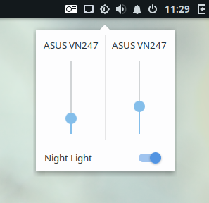

# Budgie Monitor Brightness Applet

Control your monitors brightness using the DDC/CI protocol.

---



---

## Dependencies

```
budgie-1.0 >= 2
ddcutil >= 0.9.0
```

These can be installed on Solus by running:

```bash
sudo eopkg it -c system.devel
sudo eopkg it budgie-desktop-devel ddcutil-devel
```

## Test, if your hardware is capable of DDC/CI (internal monitors won't need this)

Use [ddcutil](https://www.ddcutil.com/) to check, if your hardware is capable of DDC/CI:

The i2c_dev module has to be active:

```bash
sudo modprobe i2c_dev
```

Test, if your monitor is capable of DDC/CI (you may have to enable a feature called DDC/CI in your monitor OSD):

```bash
sudo ddcutil detect
```

Here an overview of your connected monitors has to be shown, otherwise the budgie-monitor-brightness-applet won't work.
If you are using a Nvidia graphics card and the output gives you error messages like "Invalid display" and "DDC communication failed" for your monitor, you may need another [workaround](https://www.ddcutil.com/nvidia/).


On Solus this issue can be fixed by running

```bash
echo 'nvidia.NVreg_RegistryDwords=RMUseSwI2c=0x01 nvidia.RMI2cSpeed=100' | sudo tee /etc/kernel/cmdline.d/90_nvidia.conf
sudo clr-boot-manager update # reboot after this
```

## Building and Installation

```bash
meson --prefix=/usr --buildtype=plain build
cd build
ninja
sudo ninja install
```

Finally reboot


## Manual configuration

The build script automatically sets udev rules to give everyone RW access to the /dev/i2c devices and sets the kernel-module **i2c_dev** to be loaded on every startup. If you want to configure this yourself manually, you can pass the parameters **-Dset_udev_configuration=false** and **-Dset_kernel_module_configuration=false** to meson. This could be useful, if you want to add a special group that gains access to your i2c devices. More information at  [https://www.ddcutil.com/config/](https://www.ddcutil.com/config/)


### Manual configuration of udev

Add a group that gains permissions to access the I²C interfaces and add your user to that group:

```bash
sudo groupadd --system i2c
sudo usermod $USER -aG i2c
```

ddcutil comes with an udev rule that gives the group i2c RW permissions to the i2c interfaces. This one has to be copied to /etc/udev/rules.d

```bash
sudo cp /usr/share/ddcutil/data/45-ddcutils-i2c.rules /etc/udev/rules.d
```

### Manual configuration of kernel module

The module **i2c_dev** has to be loaded on every startup:

```bash
sudo sh -c "echo i2c_dev > /etc/modules-load.d/i2c-dev.conf"
```

Finally reboot


## TODO

- [x] support external monitors

- [x] support internal displays

- [x] add translations

- [ ] detect connect and disconnect of external monitors
